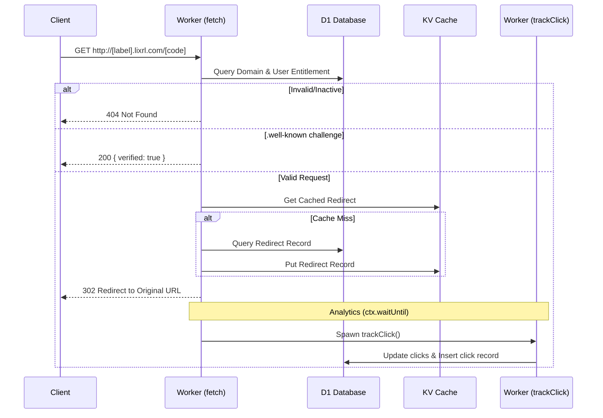

# lixrl

**Short links that are easy to create, share, and understand.**

Turn a long web address into a clean Lixrl link, then see how people use it.

[Open Lixrl](https://lixrl.com) · [View pricing](https://lixrl.com/pricing) · [Read the guides](https://lixrl.com/docs) · [Join the discussion](https://github.com/orgs/elixpo/discussions)

## What is Lixrl?

Lixrl turns long web addresses into short links such as `lixrl.com/launch`.
It is useful for social posts, campaigns, portfolios, QR codes, and anywhere a
long address would be difficult to share.

You can create one guest link without an account. It remains active for 24
hours. A free account gives you persistent links and a dashboard.

## What can you do with it?

- **Create clean links** — Replace long addresses with short, memorable ones.
- **See link activity** — Understand how often a link is opened and where its
  visitors come from.
- **Choose your link name** — Paid plans can use names such as
  `lixrl.com/product-launch`.
- **Set an expiry date** — End access automatically after an event or campaign.
- **Create QR codes** — Use the [quick QR code generator](https://lixrl.com/generate) to share any destination in print or in person.
- **Use a branded subdomain** — Paid plans can claim addresses such as
  `yourbrand.lixrl.com`.

## Choose a plan

| Plan | Free | Pro | Business |
|:--|:--:|:--:|:--:|
| Best for | Personal use | Creators and products | Teams and campaigns |
| Stored links | 25 | 1,000 | 10,000 |
| New links | 2 each day | Up to the plan limit | Up to the plan limit |
| Link activity history | 7 days | 30 days | 1 year |
| Custom link names | — | Included | Included |
| Branded Lixrl subdomains | — | 1 | 3 |
| Price | Free | From $5/month | From $19/month |

See current INR and USD prices, annual savings, and the full comparison on the
[pricing page](https://lixrl.com/pricing).

## How to begin

1. Visit [lixrl.com](https://lixrl.com).
2. Paste the address you want to shorten.
3. Copy and share the new link.

Sign in with an Elixpo account when you want to keep links, view activity, or
use paid features. The Free plan does not require a card.

## Branded subdomains

Pro and Business members can give their links a recognizable home under
Lixrl. For example, a studio named Northstar could use
`northstar.lixrl.com/summer`.

Lixrl continues to provide the service and the `lixrl.com` address. The first
part belongs to the member's brand. Bringing a completely separate domain is
not available yet.

## Part of Elixpo

Lixrl is an official [Elixpo](https://elixpo.com) product. The same Elixpo
account works across supported products, so there is no separate Lixrl
password to remember.

Other projects include [Elixpo Blogs](https://blogs.elixpo.com),
[LixSketch](https://sketch.elixpo.com),
[Elixpo Search](https://search.elixpo.com), and
[Elixpo Accounts](https://accounts.elixpo.com).

## Edge Architecture

Lixrl relies on a Cloudflare Worker acting as a subdomain router at the edge. The following high-level diagram illustrates how incoming short link requests are intercepted, validated against user entitlements, and resolved via a fast KV cache or D1 database before silently logging analytics.

## Built in the open

Lixrl is shaped by contributors and its users. You can report a problem,
suggest an improvement, or help with the project:

- Read [CONTRIBUTING.md](CONTRIBUTING.md) before contributing.
- Follow the [Code of Conduct](CODE_OF_CONDUCT.md).
- Start or join a conversation in [GitHub Discussions](https://github.com/orgs/elixpo/discussions).
- Support ongoing work through [GitHub Sponsors](https://github.com/sponsors/Circuit-Overtime).

Thank you to [Karan](https://github.com/karanray06) and the
[GDG JIS University](https://gdg.community.dev/gdg-on-campus-jis-university-kolkata-india/)
community for helping shape the project's early direction.

## Brand and license

The source code is available under the [MIT license](LICENSES/preferred/MIT).
Visual assets are available under
[CC BY 4.0](LICENSES/preferred/CC-BY-4.0). The Elixpo and Oreo names, marks,
domains, and protected brand elements remain reserved. See
[LICENSE](LICENSE) and [NOTICE](LICENSES/NOTICE) for the complete terms.

Forks may reuse the source under the license, but must use a different product
name and domain. Brand files for this project are kept in [`public/`](public/).

---

  Made in the open, together. © 2023–2026 Elixpo.

